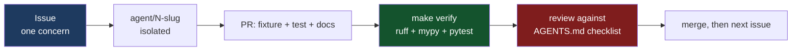

# Contributing

Thanks for taking a look. This project is opinionated on purpose: a triage tool that hedges
everywhere is not usable during an incident.

## The shape of a change

Work is distributed as issues. One issue = one branch = one PR = one concern. If your change
touches a file you do not own (see `AGENTS.md` §1), it is two changes.



## Setup

```bash
make setup     # uv venv + `pip install -e '.[dev]'`
make doctor    # tshark present and usable?  exits 2 if not
make captures  # public sample captures for the regression suite
make fixtures  # synthetic fixtures
```

`make verify` is what CI runs and what a PR must be green against.

## Ground rules

1. **Prove it with a capture.** Every finding needs a fixture, and every detector needs a test that
   asserts on *codes*, not on prose. Wording changes should never break the suite.
2. **Show the frame.** A finding without a frame number is a rumour. The report is only as useful
   as its traceability.
3. **Never leak secrets into an artifact.** Reports get pasted into tickets. Redact at the model
   boundary, and add a test that greps the output.
4. **Fail loud, not quiet.** Unknown cipher id, unparseable certificate, missing tshark field:
   each becomes a finding or a note, never a silent skip.
5. **Heuristics say so.** If it is a heuristic, `confidence` is `low` and the summary names the
   false-positive sources.

## Adding a detector

Copy `src/pcapforensics/detectors/_template.py`, follow `docs/detector-authoring.md`, and you are
done. No registration step: `registry.py` discovers the file.

## Changing the schema

Schema changes are a merge event, not a parallel event. Open an issue that says:

* the field you need, its type, and an example value from a real capture,
* which detectors read it and which are blocked without it,
* whether `schema_version` should bump (it does for a breaking change to `report.json`).

## Adding a tshark field

1. Prove it exists in the target build: `tshark -G fields | rg <field>`.
2. Add it to the pass in `src/pcapforensics/tshark.py` and record it in `docs/tshark-fields.md`.
3. Add it to `REQUIRED_FIELDS` in `tests/test_tshark_layer.py` if the project cannot work without it.

If a field is not available in some builds, the runner drops it and notes it. That is the designed
behaviour, not a bug to work around.

## Regenerating the cipher registry

```bash
make regenerate          # from the vendored name table (no network)
python scripts/gen_cipher_suites.py --refresh   # re-extract names from tshark first
```

Never hand-edit `data/cipher_suites.json`. It is generated, and `tests/test_cipher_registry.py`
compares it against the vendored names.

## Style

* `ruff` for lint and format, `mypy --strict` for types. Both are non-negotiable.
* Comments explain *why*, not *what*. A comment that restates the line below it is noise.
* Docstrings on public functions say what the caller can rely on, and what happens when the input
  is missing.

## Review checklist

Reviewers check, in order:

1. Is every finding traceable to a frame?
2. Could a reader act on it (remediation present, references correct)?
3. Is severity about impact and confidence about evidence?
4. Does it stay inside the file allowlist on the issue?
5. Do the tests fail without the change?
6. `make verify` green.
