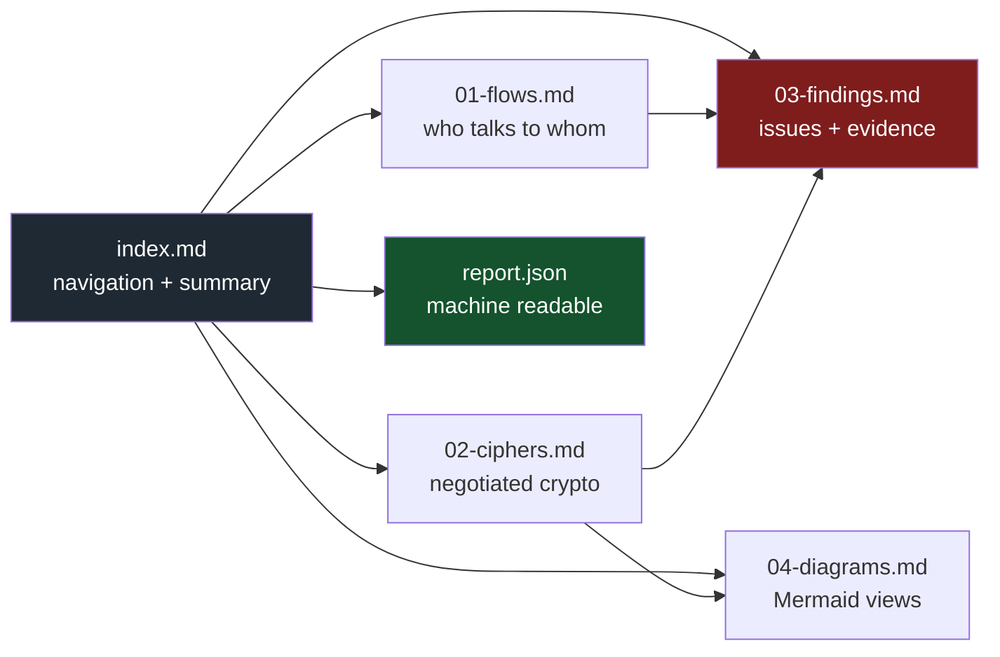
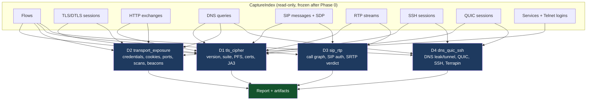
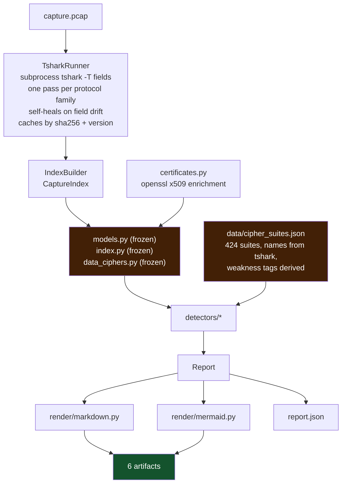

<picture>
  <source media="(prefers-color-scheme: dark)" srcset="./docs/assets/logo-dark.svg">
  <source media="(prefers-color-scheme: light)" srcset="./docs/assets/logo-light.svg">
  
</picture>

[](https://github.com/Vaibhav91one/pcap-forensics/actions/workflows/ci.yml)
[](pyproject.toml)
[](https://www.wireshark.org/docs/man-pages/tshark.html)
[](LICENSE)
[](#privacy-and-telemetry)

**Hand it a capture. It tells you who talked to whom, what crypto they negotiated, what is weak or leaking, and what to do about it.**

`pf` is an offline command-line auditor for `.pcap` and `.pcapng` files, built for IoT, OTA and
network-device traffic. One command turns a capture into six files you can paste into a ticket: an
index, a flow table, a crypto matrix, findings with evidence, Mermaid diagrams, and a JSON report
for CI. Every claim it makes points at a frame number you can open in Wireshark.

No network access. No agent. No telemetry. Secrets it finds are reported, never repeated.

## Get started

### 1. Install

You need Python 3.11+, [`tshark`](https://www.wireshark.org/docs/man-pages/tshark.html) on `PATH`,
and `openssl` (used only to read certificates exactly; the tool degrades without it).

```bash
# macOS
brew install wireshark          # provides tshark

# Debian / Ubuntu
sudo apt-get install -y tshark
```

```bash
git clone https://github.com/Vaibhav91one/pcap-forensics.git && cd pcap-forensics
make setup      # uv venv + editable install with dev extras
make doctor     # checks tshark and the fields and preferences it knows
```

### 2. Run your first audit

```bash
pf analyze traffic.pcap                 # writes traffic.pf-report/
pf analyze traffic.pcap --out report/   # or choose the folder
```

Then open `report/index.md`. No capture to hand? `make captures` fetches the Wireshark project's
public samples, and `make analyze` runs one.

### 3. Gate CI on it

`--fail-on` turns the report into a pass/fail check, and exits `1` when a finding at or above that
severity exists:

```yaml
# .github/workflows/pcap.yml
- run: sudo apt-get install -y tshark
- run: pip install git+https://github.com/Vaibhav91one/pcap-forensics.git
- run: pf analyze captures/device-boot.pcap --out pf-report --fail-on high
```

### 4. Choose what to look for

```bash
pf analyze traffic.pcap --only d1.tls_cipher          # one detector (repeatable)
pf analyze traffic.pcap --min-severity medium         # hide low / info
pf detectors                                          # list detectors and versions
```

Quick console views, no report written:

```bash
pf flows   traffic.pcap     # top conversations
pf ciphers traffic.pcap     # sender -> recipient, suite, version, forward secrecy
```

---

## Table of contents

- [What it catches](#what-it-catches)
- [The report](#the-report)
- [Detectors](#detectors)
- [Architecture](#architecture)
- [How a finding is born](#how-a-finding-is-born)
- [Cipher policy](#cipher-policy)
- [Trust and honesty rules](#trust-and-honesty-rules)
- [CLI reference](#cli-reference)
- [Privacy and telemetry](#privacy-and-telemetry)
- [Testing](#testing)
- [Contributing](#contributing)
- [Known limits](#known-limits)
- [License](#license)

---

## What it catches

- **Weak and deprecated TLS/DTLS** - prohibited and legacy suites, deprecated versions, missing
  forward secrecy, weak suites a client still *offers*, expired or weak certificates, self-signed
  chains, alerts and truncated handshakes, JA3 fleet clustering.
- **Credentials in cleartext** - HTTP Basic/Digest, SNMP communities, FTP `PASS`, LDAP simple binds,
  MySQL queries and Telnet logins, always redacted to `<redacted N chars>`.
- **Plaintext exposure** - cleartext FTP, Telnet, TFTP, NTP, SNMP, LDAP, SMTP, POP and MySQL;
  cookies without `Secure`; services on non-standard ports.
- **Voice and media** - cleartext SIP signalling, SDP offered without `a=crypto`, RTP media in the
  clear, and the SIP call graph.
- **DNS** - plaintext DNS leakage, external resolvers over IPv4 and IPv6, DNS tunnelling shapes.
- **SSH and QUIC** - weak SSH key exchange, cipher, MAC and host-key offers; Terrapin exposure
  (CVE-2023-48795); QUIC version inventory and payload opacity.
- **Network shape** - unanswered-SYN scans and beaconing measured by regular gaps between bursts.

The distinction that matters is **negotiated** versus **offered**. A TLS 1.3 session is fine even
if the same ClientHello still offers 3DES for TLS 1.2; that is reported as downgrade surface, not as
a weakness of the session.

---

## The report

Every run writes six files, meant to be read in order and pasted into a ticket.

| Question | Where the answer lands |
|---|---|
| What communication is happening? | `01-flows.md`: every conversation with bytes, duration, protocol and an encrypted/cleartext verdict |
| Which cipher is used between *this* sender and *this* recipient? | `02-ciphers.md`: per-flow matrix of version, chosen suite, offered count, forward secrecy, SNI, certificate |
| Is that cipher weak? | `03-findings.md`: every weak, prohibited or deprecated suite, with the frame it was seen in |
| What else is wrong? | `03-findings.md`: credentials, cookies, SIP/RTP, DNS, SSH, scans, beaconing, certificates |
| What do I do about it? | every finding carries a remediation and, where one exists, an RFC, CWE or CVE reference |



| File | Read it for |
|---|---|
| `index.md` | capture identity (path, SHA-256, size, window), packet/flow/host counts, severity histogram, notes, cipher-policy provenance |
| `01-flows.md` | host table, every conversation with orientation, bytes, duration, crypto verdict and the evidence for that verdict, plus a cleartext-only section |
| `02-ciphers.md` | the matrix (sender → recipient), then per-session detail: version, record versions, chosen suite, forward secrecy, offered suites, SNI, ALPN, JA3/JA3S, certificate chain, alerts; also QUIC inventory and SSH algorithm offers |
| `03-findings.md` | triage table (worst first), then per-finding detail: severity, confidence, code, evidence table, remediation, references, tags |
| `04-diagrams.md` | topology graph, crypto matrix graph, severity pie, per-detector bar chart, RTP timeline, SIP sequence diagrams |
| `report.json` | the same data with a stable `schema_version`, for diffing between runs |

<details>
<summary><b>Sample finding</b></summary>

```markdown
### 3. TLS_RSA_WITH_AES_128_CBC_SHA negotiated on tcp:10.0.0.1:41832<->10.0.0.243:443

- **Severity**: 🟠 high
- **Confidence**: high
- **Code**: `d1.tls_cipher.TLS_CIPHER_WEAK`

10.0.0.243:443 completed a handshake at TLS 1.2 with a static RSA key exchange
(RSA); no forward secrecy: a later compromise of the server private key decrypts
all recorded past traffic on this session.

| Frame | Field                | Value                             |
|-------|----------------------|-----------------------------------|
| 20    | `tls.handshake.ciphersuite` | `TLS_RSA_WITH_AES_128_CBC_SHA` |
| 19    | `tls.handshake.ciphersuite[offered]` | `1 suite(s) offered by the client` |
```

</details>

---

## Detectors

One file, one detector, discovered automatically: `pcapforensics/registry.py` loads every
non-underscore module in `detectors/`, so adding one needs no registration.

| Id | Module | Owns |
|---|---|---|
| `d1.tls_cipher` | `detectors/tls_cipher.py` | negotiated version, chosen suite, offered-but-unused weak suites, forward secrecy, certificate expiry/key/signature/self-signed, alerts, truncated handshakes, JA3 fleet clustering |
| `d2.transport_exposure` | `detectors/transport_exposure.py` | HTTP Basic/Digest over cleartext, Basic inside TLS, cookies without `Secure`, cleartext FTP/Telnet/NTP/SNMP/LDAP/SMTP/POP/MySQL/TFTP, leaked credentials (SNMP community, FTP `PASS`, LDAP simple bind, MySQL queries, Telnet logins; always redacted), services on odd ports (lower-port side, low confidence), unanswered-SYN scan shapes, beaconing (regular gaps between bursts) |
| `d3.sip_rtp` | `detectors/sip_rtp.py` | SIP call graph, cleartext REGISTER/INVITE with auth headers, SDP offered without `a=crypto` (no SRTP possible), RTP media in the clear, media volume anomalies |
| `d4.dns_quic_ssh` | `detectors/dns_quic_ssh.py` | plaintext DNS leakage, DNS tunnelling heuristics (label depth + entropy + TXT/NULL volume), external resolvers (IPv4 and IPv6), QUIC version inventory and payload opacity, weak SSH kex/cipher/MAC/host-key offers, Terrapin exposure (CVE-2023-48795) |



---

## Architecture



<details>
<summary><b>Why <code>tshark</code> and not pyshark</b></summary>

`pyshark` was on the table. It is not used, for three reasons that cost real bugs to learn:

1. **Field names stay visible.** Every field the analyzer uses is pinned against `tshark -G fields`,
   and drift is recorded in `report.notes`. When tshark renames something, the run degrades into a
   note instead of into a wrong answer.
2. **Determinism.** One process per pass, `-T fields`, tab-separated, a documented aggregator
   character. Output is snapshot-testable.
3. **Python 3.13+ support is not a coin flip.** pyshark's last release predates it.

If you want pyshark anyway, it belongs behind the same source interface as a notebook adapter. It
must never be on the critical path.

</details>

<details>
<summary><b>Self-healing tshark layer</b></summary>

Field names move between tshark releases, and one release may not know a protocol at all
(`dtls.desegment_dtls_records` does not exist in 4.6.6). The runner therefore:

- validates every requested field against `tshark -G fields` and drops unknown ones,
- validates every bare protocol token in a display filter against `tshark -G protocols`,
- only passes preferences the build actually has (`tshark -G defaultprefs`),
- retries with a fix-up if tshark still rejects a `-o` flag, and records every drop.

`tests/test_tshark_layer.py` pins the fields the project cannot work without, including every
service field the index reads, so a tshark upgrade that breaks us fails CI instead of silently
returning fewer findings.

</details>

<details>
<summary><b>Certificates</b></summary>

tshark flattens X.509 into a bag of RDN strings with no subject/issuer split and no key size.
`certificates.py` takes the real route: `tls.handshake.certificate` (raw DER, one occurrence per
certificate) → PEM → `openssl x509 -noout -text`. Subject, issuer, validity, key size, signature
algorithm, SANs and self-signedness are exact. If openssl is missing, the tool falls back to the
flattened tshark values, marks `name_source`, and adds a note.

</details>

---

## How a finding is born

```mermaid
sequenceDiagram
  participant U as analyst
  participant P as pipeline
  participant I as CaptureIndex
  participant D as detector
  participant R as Report
  U->>P: pf analyze capture.pcap
  P->>I: build (one tshark pass per protocol family, cached)
  I-->>D: frozen read-only view
  D->>D: decide, attach frame-numbered evidence
  D-->>P: list[Finding]
  Note over P: one detector raising is caught;<br/>the other detectors still run
  P->>R: sort by severity, then confidence
  R-->>U: 6 artifacts + exit code
```

A finding is only valid if it carries a **stable id**, a **real frame number** and a **remediation**.
Tests enforce the mechanical parts: every finding on every fixture and corpus capture must cite a
frame above 0, and every reference must be something a reader can look up.

`Finding.id` is `detector.code.sha256(scope)[:16]`, so re-running the same capture produces the
same ids and two reports can be diffed.

---

## Cipher policy

The registry holds **424 suites**. Names and ids come from tshark's own value table
(`tshark -G values`), vendored in `data/cipher_names.tsv`; everything else is derived from the IANA
name, which encodes key exchange, cipher, mode and MAC structurally.

This is deliberate. The first version hand-typed the common suites and **22 of the ids were wrong**
(`0x0008` was labelled with the suite that lives at `0x0009`, and so on). A registry that lies
about which id is which is worse than no registry, so `scripts/gen_cipher_suites.py` derives
everything and `tests/test_cipher_registry.py` proves the registry agrees with tshark for all 424
entries.

| Tier | Meaning | Typical severity |
|---|---|---|
| `prohibited` | NULL, export-grade, RC4, RC2, DES, 3DES, IDEA, SEED, MD5, anonymous, CRC32, GOST | critical / high |
| `deprecated` | no forward secrecy (static RSA, bare PSK) | high |
| `legacy` | CBC mode or SHA-1 MAC, AEAD otherwise | medium |
| `acceptable` | AEAD with forward secrecy, TLS 1.2 | info |
| `recommended` | TLS 1.3 suites | info |
| `signalling` | SCSV and other non-cipher values | never reported |

The reasoning lives in [`docs/cipher-policy.md`](docs/cipher-policy.md). Regenerate with
`make regenerate` (add `--refresh` to re-extract the name table from tshark).

---

## Trust and honesty rules

These are the project's rules for itself, and tests enforce the mechanical ones:

1. **No silent passes.** An unknown cipher id raises `TLS_CIPHER_UNKNOWN` rather than being
   ignored. An unparseable certificate, or a field tshark does not have, produces a note.
2. **No invented facts.** If subject/issuer cannot be separated, the field is `None` and
   `name_source` says where the data came from. If forward secrecy cannot be decided, the answer
   is `None` plus a reason, not `False`.
3. **No secrets in output.** Credentials are redacted before they reach a model or a report.
   Every fixture that carries a secret has a test that greps every artifact for it.
4. **Confidence is separate from severity.** A high-severity, low-confidence item is a lead to
   investigate, and the report says so.
5. **Absence of findings is not safety.** `03-findings.md` ends with that reminder in every run.
6. **One broken detector cannot sink a run.** Detector exceptions are caught per detector and
   surfaced in `report.notes`.

---

## CLI reference

```
pf analyze CAPTURE [--out DIR] [--only ID]... [--min-severity LEVEL] [--fail-on LEVEL] [--no-cache] [-q]
pf flows   CAPTURE [--top N]
pf ciphers CAPTURE
pf detectors
pf suites
pf doctor
pf schema
```

| Exit code | Meaning |
|---|---|
| `0` | analysis finished; nothing tripped the `--fail-on` gate |
| `1` | a finding at or above the `--fail-on` severity exists |
| `2` | the environment cannot run an analysis (for example, tshark is missing) |

`--fail-on {none,critical,high,medium,low,info}` defaults to `none`: report, do not fail. The
tshark pass cache lives in `PCAP_FORENSICS_CACHE` (default `~/.cache/pcap-forensics`) and is keyed
by capture SHA-256, tshark version and pass arguments, so editing a detector never re-runs tshark.

---

## Privacy and telemetry

`pf` collects **nothing** and makes **no network calls** during analysis. Outside of installing
dependencies, the only download in the project is `make captures`, which fetches public sample
captures on demand.

Your captures stay on your machine, but treat the reports as sensitive: they contain IP addresses,
hostnames, SNI names, usernames and certificate subjects. Passwords, community strings, tokens and
Authorization headers are replaced with `<redacted N chars>` and never written to any artifact.

---

## Testing

```bash
make test      # the full pytest suite
make verify    # ruff + mypy --strict + pytest: exactly what CI runs
```

| File | What it protects |
|---|---|
| `tests/test_cipher_registry.py` | all 424 registry entries agree with tshark; tier and forward-secrecy expectations; unknown ids fail loudly |
| `tests/test_tshark_layer.py` | every field and protocol the project needs exists (including every service field the index reads); TLS/DTLS pass field sets stay in sync; cache behaviour; self-healing paths |
| `tests/test_detectors.py` | each synthetic fixture produces exactly the codes it is meant to, with frame-numbered evidence; secrets never leak; every finding on every capture cites a real frame and a well-formed reference |
| `tests/test_corpus.py` | **real captures**: assertions written against `tshark -V` output for the same file, e.g. that `tls12-aes128ccm.pcap` negotiates TLS 1.2 with `0xC0A4` and must *not* be reported as TLS 1.0 |

Fixtures are generated, not captured by hand. `scripts/make_fixtures.py` builds byte-exact packets
for the cleartext protocols and performs genuine OpenSSL handshakes through a logging proxy for TLS
(`weak_tls.pcap` is a real TLS 1.0 session with a real certificate). Hand-rolled handshake bytes
were tried first, and a single wrong length field made tshark report `[Client Hello Fragment]` and
the whole session vanish: exactly the kind of bug this suite exists to catch.

The regression corpus in `captures/` is the Wireshark project's own test captures
(`scripts/fetch_captures.sh`). CI runs everything on every pull request.

---

## Contributing

Issues and pull requests are welcome. Work is organised as **one issue, one branch, one pull
request**, and every change ships with a fixture and a test that fails without it.

- [`CONTRIBUTING.md`](CONTRIBUTING.md): setup, ground rules and how to submit a pull request
- [`AGENTS.md`](AGENTS.md): the contract for automated agents working in isolation
- [`docs/detector-authoring.md`](docs/detector-authoring.md): writing a detector
- [`docs/subagent-playbook.md`](docs/subagent-playbook.md): running a fleet of agents safely
- [`CHANGELOG.md`](CHANGELOG.md): what changed and when

The core (`models.py`, `index.py`, `data_ciphers.py`, `tshark.py`) is frozen: a detector that needs
a new field opens an issue instead of editing the model.

---

## Known limits

Stated plainly, because a triage tool that hides its limits is worse than useless:

- **Encrypted payloads are opaque.** QUIC and TLS 1.3 application data cannot be read without a
  keylog. The tool says so rather than guessing.
- **Certificate subject/issuer need openssl.** Without it, only the flattened CN and validity
  dates are available, and the report says which source was used.
- **Some heuristics are heuristics.** DNS tunnelling and beaconing are scored on label depth,
  entropy and inter-arrival regularity, and reported with `confidence: low` unless the shape is
  strong. They are leads, not verdicts.
- **No ground truth for "who is the server".** Orientation uses port heuristics; a service on an
  odd port is reported as such instead of being silently trusted.
- **Capture point matters.** The tool sees the traffic it is given, and cannot know what the
  capture point did not record.
- **Telnet logins are found by prompt matching.** Typed keystrokes are rebuilt from the client
  stream and a password is recognised after a `Password:` prompt; logins without such a prompt are
  missed. The password itself is never stored, only its length and frame.
- **Redis is classified by port only.** tshark has no RESP dissector, so Redis commands are not
  parsed and cannot be checked for secrets.
- **JA3 clustering is v1.** It groups by fingerprint, not by a maintained JA3 database.

---

## License

[MIT](LICENSE). The captures under `captures/` belong to the Wireshark project (BSD-2-Clause) and
are fetched, not authored.
