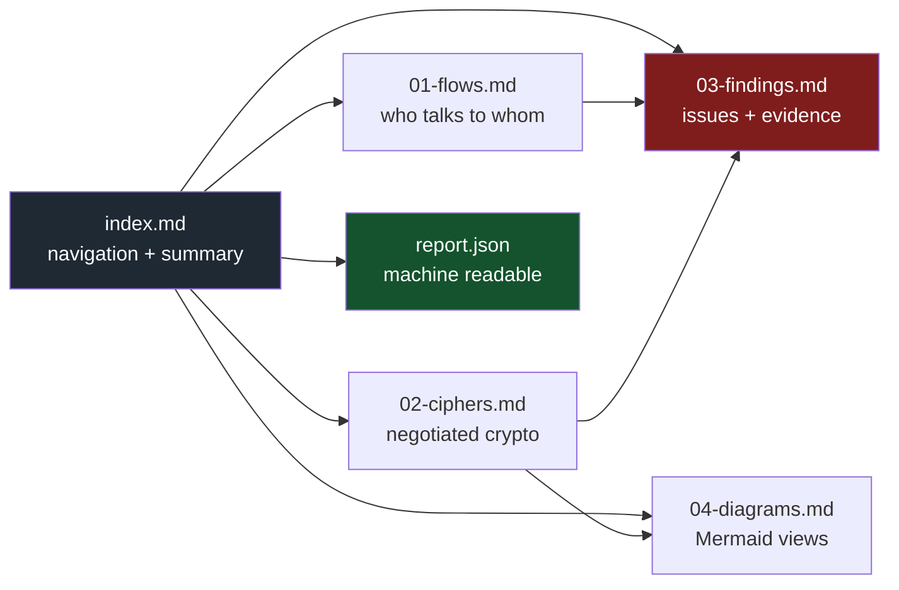
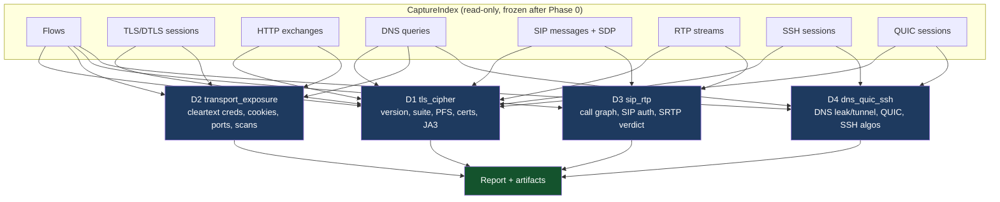
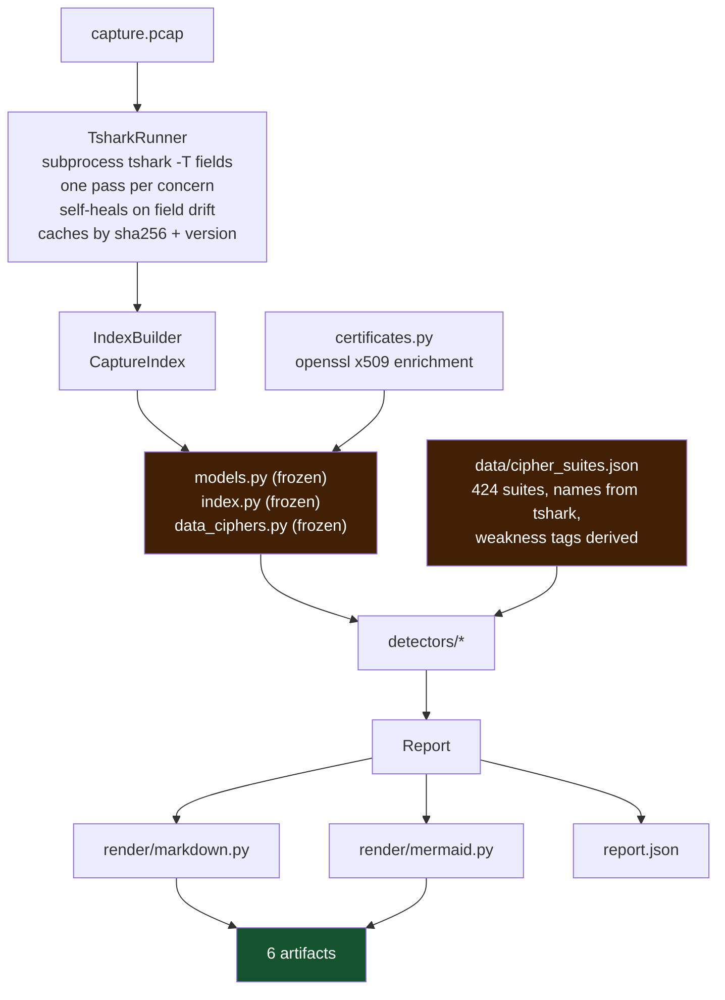

# pcap-forensics

**Offline triage of a packet capture: who talked to whom, what crypto was negotiated, what is weak, and what to do about it.**

You hand it a `.pcap`/`.pcapng`. It gives you six files: an index, a flow table, a
crypto matrix, a findings list with evidence, Mermaid diagrams, and one JSON blob for CI.
No network access, no agent, no telemetry. Everything it claims is traceable to a frame
number.

```bash
make setup          # venv + package
make doctor         # is tshark here and happy?
make analyze CAPTURE=captures/tls12-chacha20poly1305.pcap
```

---

## Contents

- [What it actually answers](#what-it-actually-answers)
- [Quick start](#quick-start)
- [The four artifacts](#the-four-artifacts)
- [The four detectors](#the-four-detectors)
- [Architecture](#architecture)
- [How a finding is born](#how-a-finding-is-born)
- [Cipher policy](#cipher-policy)
- [Trust and honesty rules](#trust-and-honesty-rules)
- [CLI reference](#cli-reference)
- [Testing](#testing)
- [Working on it](#working-on-it)
- [Known limits](#known-limits)

---

## What it actually answers

| Question | Where the answer lands |
|---|---|
| What communication is happening? | `01-flows.md` — every conversation with bytes, duration, protocol, and an encrypted/cleartext verdict |
| Which cipher is used between *this* sender and *this* recipient? | `02-ciphers.md` — per-flow matrix: sender → recipient, version, chosen suite, offered count, forward secrecy, SNI, certificate |
| Is that cipher weak? | `03-findings.md` — every weak/prohibited/deprecated suite, with the frame it was seen in |
| What else is wrong? | `03-findings.md` — cleartext credentials, insecure cookies, unauthenticated SIP, unprotected RTP, DNS tunnelling, scan shapes, certificate expiry, self-signed leaves, JA3 fleets |
| What do I do about it? | Every finding carries a `Remediation` line and, where one exists, an RFC/CVE reference |

The distinction that matters: **negotiated** versus **offered**. A TLS 1.3 session is fine even
though the same ClientHello still offers 3DES and static-RSA suites for TLS 1.2 — that is
reported as downgrade surface, not as a vulnerability of the session.

---

## Quick start

Requirements: Python 3.11+, [`tshark`](https://www.wireshark.org/docs/man-pages/tshark.html) on
`PATH`, and `openssl` (used only to read certificates properly — the tool degrades without it).

```bash
git clone <this repo> && cd pcap-forensics
make setup                       # uv venv + editable install with dev extras
make doctor                      # prints the tshark version and field inventory
make captures                    # fetch the public sample captures (regression corpus)
make fixtures                    # rebuild the synthetic fixtures
```

Analyze anything:

```bash
pf analyze traffic.pcap                     # -> traffic.pcap.pf-report/
pf analyze traffic.pcap --out /tmp/report
pf analyze traffic.pcap --only d1.tls_cipher --min-severity high
pf analyze traffic.pcap --fail-on high      # non-zero exit for CI gates
```

One-shot console summaries:

```bash
pf flows   traffic.pcap      # top conversations
pf ciphers traffic.pcap      # the crypto matrix
pf detectors                  # what is installed
pf suites                     # the cipher registry and its policy tiers
pf doctor                     # environment check
```

---

## The four artifacts

Every run writes exactly six files. They are designed to be read in order and to be pasted
into a ticket.



| File | Read it for |
|---|---|
| `index.md` | capture identity (path, SHA-256, size, window), packet/flow/host counts, severity histogram, notes, cipher-policy provenance |
| `01-flows.md` | host table, every conversation with orientation, bytes, duration, crypto verdict and the evidence for that verdict, plus a cleartext-only section |
| `02-ciphers.md` | the matrix (sender → recipient), then per-session detail: version, record versions, chosen suite, forward secrecy, offered suites, SNI, ALPN, JA3/JA3S, certificate chain, alerts. Also QUIC inventory and SSH algorithm negotiation |
| `03-findings.md` | triage table (worst first) then per-finding detail: severity, confidence, code, evidence table, remediation, references, tags |
| `04-diagrams.md` | topology graph, crypto matrix graph, severity pie, per-detector bar chart, RTP timeline, SIP sequence diagrams |
| `report.json` | the same data with a stable `schema_version`, for diffing between runs |

### Sample finding

```markdown
### 3. TLS_RSA_WITH_AES_128_CBC_SHA negotiated on tcp:10.0.0.1:41832<->10.0.0.243:443

- **Severity**: 🟠 high
- **Confidence**: high
- **Code**: `d1.tls_cipher.TLS_CIPHER_WEAK`

10.0.0.243:443 completed a handshake at TLS 1.2 with a static RSA key exchange
(RSA); no forward secrecy: a later compromise of the server private key decrypts
all recorded past traffic on this session.

| Frame | Field                | Value                             |
|-------|----------------------|-----------------------------------|
| 20    | `tls.handshake.ciphersuite` | `TLS_RSA_WITH_AES_128_CBC_SHA` |
| 19    | `tls.handshake.ciphersuite[offered]` | `1 suite(s) offered by the client` |
```

The credential-free rule applies here too: HTTP Basic headers, SIP digest responses and
SNMP community strings are reported as `<redacted N chars>`. There is a test that fails if a
secret ever reaches an artifact.

---

## The four detectors

One file, one detector, one issue on the board.



| Id | Module | Owns |
|---|---|---|
| `d1.tls_cipher` | `detectors/tls_cipher.py` | negotiated version, chosen suite, offered-but-unused weak suites, forward secrecy, certificate expiry/key/signature/self-signed, alerts, truncated handshakes, JA3 fleet clustering |
| `d2.transport_exposure` | `detectors/transport_exposure.py` | HTTP Basic/Digest over cleartext, Basic inside TLS, cookies without `Secure`, cleartext FTP/Telnet/NTP/SNMP/LDAP/SMTP/Redis/MySQL/TFTP, leaked credentials, services on odd ports, unanswered-SYN scan shapes, beaconing shape |
| `d3.sip_rtp` | `detectors/sip_rtp.py` | SIP call graph, cleartext REGISTER/INVITE with auth headers, SDP offered without `a=crypto` (no SRTP possible), RTP media in the clear, media volume anomalies |
| `d4.dns_quic_ssh` | `detectors/dns_quic_ssh.py` | plaintext DNS leakage, DNS tunnelling heuristics (label depth + entropy + TXT/NULL volume), external resolvers, QUIC version inventory and payload opacity, weak SSH kex/cipher/MAC/host-key negotiation |

Add one without touching any registry: `pcapforensics/registry.py` discovers every non-underscore
module in the package.

---

## Architecture



### Why `tshark` and not pyshark

`pyshark` was on the table. It is not used, for three reasons that cost us real bugs to learn:

1. **Field names stay visible.** The analyzer pins every field it uses against `tshark -G fields`
   and records drift in `report.notes`. When tshark renames something, the run degrades into a
   note instead of into a wrong answer.
2. **Determinism.** One process per pass, `-T fields`, tab-separated, a documented aggregator
   character. Output is snapshot-testable.
3. **Python 3.13+ support is not a coin flip.** pyshark's last release predates it.

If you want pyshark anyway, it belongs behind the same `PacketSource` idea as an adapter for
notebooks — there is an issue for it. It must never be on the critical path.

### Self-healing tshark layer

Field names move between tshark releases, and one release may not know a protocol at all
(`dtls.desegment_dtls_records` does not exist in 4.6.6). The runner therefore:

* validates every requested field against `tshark -G fields` and drops unknown ones,
* validates every bare protocol token in a display filter against `tshark -G protocols`,
* only passes preferences the build actually has (`tshark -G defaultprefs`),
* retries with a fix-up if tshark still rejects a `-o` flag, and records every drop.

A test (`test_tshark_layer.py`) pins the fields the project cannot work without, so a tshark
upgrade that breaks us fails CI instead of silently returning fewer findings.

### Certificates

tshark flattens X.509 into a bag of RDN strings with no subject/issuer split and no key size.
`certificates.py` takes the real route: `tls.handshake.certificate` (raw DER, one occurrence per
certificate) → PEM → `openssl x509 -noout -text`. Subject, issuer, validity, key size, signature
algorithm, SANs and self-signedness are exact. If openssl is missing, the tool falls back to the
flattened tshark values, marks `name_source`, and adds a note.

---

## How a finding is born

```mermaid
sequenceDiagram
  participant U as analyst
  participant P as pipeline
  participant I as CaptureIndex
  participant D as detector
  participant R as Report
  U->>P: pf analyze capture.pcap
  P->>I: build (9 tshark passes, cached)
  I-->>D: frozen read-only view
  D->>D: decide, attach frame-numbered evidence
  D-->>P: list[Finding]
  Note over P: one detector raising is caught;<br/>the other detectors still run
  P->>R: sort by severity, then confidence
  R-->>U: 6 artifacts + exit code
```

A finding is only valid if it carries a **stable id**, a **frame number**, and a **remediation**.
That is enforced in review, and partly in tests (`test_weak_tls_findings_carry_frame_numbered_evidence`).

`Finding.id` is `detector.code.sha256(scope)[:16]`, so re-running the same capture produces the
same ids and two reports can be diffed meaningfully.

---

## Cipher policy

The registry holds **424 suites**. Names and ids come from tshark's own value table
(`tshark -G values`), vendored in `data/cipher_names.tsv`; everything else is derived from the
IANA name, which encodes key exchange, cipher, mode and MAC structurally.

This is deliberate. The first version of this project hand-typed the common suites and **22 of
the ids were wrong** — `0x0008` was labelled with the suite that actually lives at `0x0009`, and
so on. A registry that lies about which id is which is worse than no registry, so
`scripts/gen_cipher_suites.py` now derives everything and `tests/test_cipher_registry.py` proves
the registry agrees with tshark for all 424 entries.

Tiers (`deprecation` in the JSON, `docs/cipher-policy.md` for the reasoning):

| Tier | Meaning | Typical severity |
|---|---|---|
| `prohibited` | NULL, export-grade, RC4, RC2, DES, 3DES, IDEA, SEED, MD5, anonymous, CRC32, GOST | critical / high |
| `deprecated` | no forward secrecy (static RSA, bare PSK) | high |
| `legacy` | CBC mode or SHA-1 MAC, AEAD otherwise | medium |
| `acceptable` | AEAD with forward secrecy, TLS 1.2 | info |
| `recommended` | TLS 1.3 suites | info |
| `signalling` | SCSV and other non-cipher values | never reported |

Regenerate with `make regenerate` (add `--refresh` to re-extract the name table from tshark).

---

## Trust and honesty rules

These are the project’s rules for itself, and the tests enforce the mechanical ones:

1. **No silent passes.** An unknown cipher id raises `TLS_CIPHER_UNKNOWN` at medium rather than
   being ignored. An unparseable certificate produces a note. A field that tshark does not have
   produces a note.
2. **No invented facts.** If subject/issuer cannot be separated, the field is `None` and
   `name_source` says where the data came from. If forward secrecy cannot be decided, the answer
   is `None` plus a reason — not `False`.
3. **No secrets in output.** Credentials are redacted before they reach a model. Tested.
4. **Confidence is separate from severity.** A high-severity, low-confidence item is a lead to
   investigate, and the report says so.
5. **Absence of findings is not safety.** `03-findings.md` ends with that reminder in every run.
6. **One broken detector cannot sink a run.** Detector exceptions are caught per detector and
   surfaced in `report.notes`.

---

## CLI reference

```
pf analyze CAPTURE --out DIR [--only ID]... [--min-severity LEVEL] [--fail-on LEVEL] [--no-cache] [-q]
pf flows   CAPTURE [--top N]
pf ciphers CAPTURE
pf detectors
pf suites
pf doctor
pf schema
```

`--fail-on {none,critical,high,medium,low,info}` is the CI gate; the default `none` means
"report, do not fail". `analyze` also honours `PCAP_FORENSICS_CACHE` for the tshark pass cache
(default `~/.cache/pcap-forensics`), which is keyed by capture SHA-256, tshark version and pass
arguments, so editing a detector never re-runs tshark.

---

## Testing

```bash
make test      # 88 tests, ~30s
make verify    # ruff + mypy --strict + pytest, what CI runs
```

Three layers, and the third is the one that matters:

| File | What it protects |
|---|---|
| `tests/test_cipher_registry.py` | all 424 registry entries agree with tshark; tier and forward-secrecy expectations for hand-picked suites; unknown ids fail loudly |
| `tests/test_tshark_layer.py` | every field and protocol the project needs exists; TLS/DTLS pass field sets stay in sync; cache behaviour; self-healing paths |
| `tests/test_detectors.py` | each synthetic fixture produces exactly the codes it is meant to produce, with frame-numbered evidence, and secrets never leak |
| `tests/test_corpus.py` | **real captures**: assertions written against `tshark -V` output for the same file, e.g. that `tls12-aes128ccm.pcap` negotiates TLS 1.2 with `0xC0A4` and must *not* be reported as negotiated TLS 1.0 |

Fixtures are generated, not captured by hand: `scripts/make_fixtures.py` performs a genuine
OpenSSL handshake through a logging proxy and splices the real wire bytes into a pcap
(`weak_tls.pcap` is a real TLS 1.0 session with a real certificate). Hand-rolled handshake bytes
were tried first and a single wrong length field made tshark report `[Client Hello Fragment]` and
the whole session vanish — which is exactly the kind of bug this suite exists to catch.

The regression corpus in `captures/` is the Wireshark project's own test captures
(`scripts/fetch_captures.sh`).

---

## Working on it

Work is distributed as GitHub issues, one issue per change, and `AGENTS.md` holds the contract
for subagents working in isolation. The short version:

* the core (`models.py`, `index.py`, `data_ciphers.py`, `tshark.py`) is **frozen** after Phase 0;
  a detector that needs a new field opens an issue instead of editing the model,
* every detector is one file, imports no sibling detector, and is discovered automatically,
* “done” means: synthetic fixture + test + detector table row in this README + `make verify` green.

Start here: [`CONTRIBUTING.md`](CONTRIBUTING.md), [`AGENTS.md`](AGENTS.md),
[`docs/detector-authoring.md`](docs/detector-authoring.md), [`docs/subagent-playbook.md`](docs/subagent-playbook.md).

---

## Known limits

Stated plainly, because a triage tool that hides its limits is worse than useless:

* **Encrypted payloads are opaque.** QUIC and TLS 1.3 application data cannot be read without a
  keylog. The tool says so rather than guessing.
* **Certificate subject/issuer need openssl.** Without it, only the flattened CN and validity
  dates are available and the report says which source was used.
* **Some heuristics are heuristics.** DNS tunnelling and beaconing are scored on label depth,
  entropy and inter-arrival regularity, and reported with `confidence: low` unless the shape is
  strong. They are leads, not verdicts.
* **No ground truth for "who is the server".** Orientation uses port heuristics; a service on an
  odd port is reported as such instead of being silently trusted.
* **Capture point matters.** This tool sees the traffic it is given. It cannot know what the
  capture point did not record.
* **JA3 clustering is v1.** It groups by fingerprint, not by a maintained JA3 database.

---

## License

MIT. The captures under `captures/` belong to the Wireshark project (BSD-2-Clause) and are
fetched, not authored.
