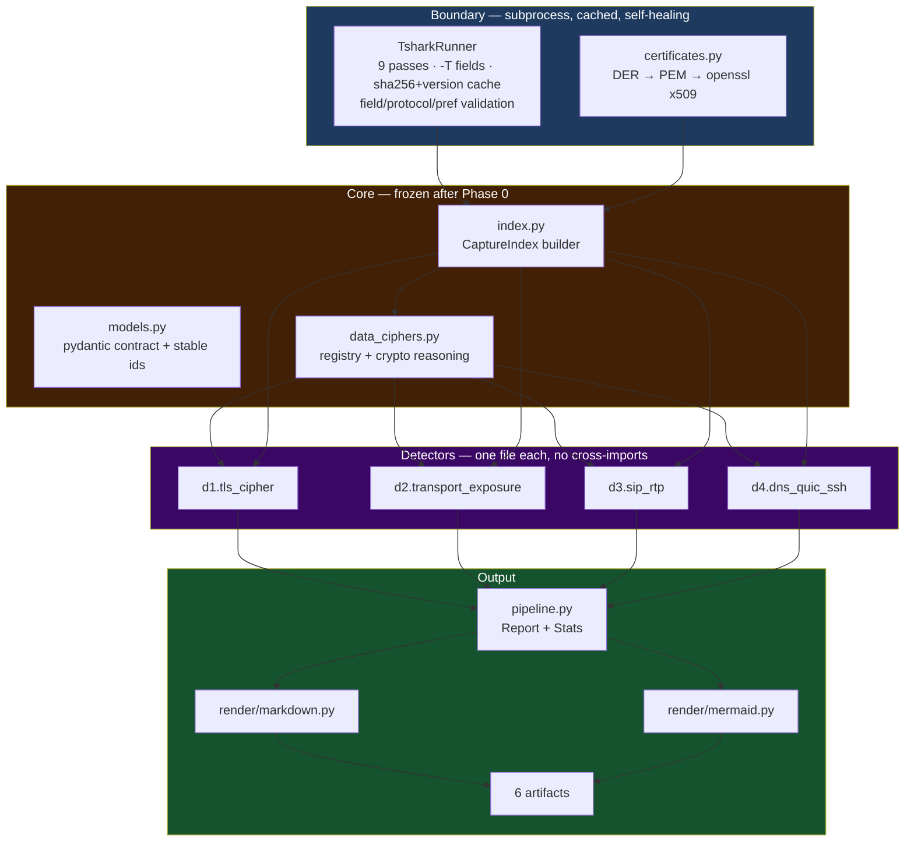

# Architecture

One paragraph: tshark is the parser, `CaptureIndex` is the only view a detector gets, detectors are
pure functions that return findings, and renderers turn one `Report` into six files.

## Layers

## The CaptureIndex

One `CaptureIndex` per capture, built once, read many times. It holds:

* `Flow` per direction-independent conversation: bytes, packets, window, L4 protocol, application
  protocol, SYN/FIN/RST counts, handshake completion, and an `encrypted: bool | None` verdict with
  the evidence that produced it,
* `Host` per IP: flow, byte and packet totals, first/last seen, inferred roles,
* protocol projections: `TlsSession`, `HttpExchange`, `DnsQuery`, `SipMessage`, `RtpStream`,
  `SshSession`, `QuicSession`, `ServiceHit`,
* `notes`: everything a detector or the parser wants to tell the analyst.

Detectors get a read-only view of that. They cannot parse tshark output themselves, which is what
makes "add a check" a one-file change and what keeps four detectors speaking one schema.

## The tshark boundary

`TsharkRunner` runs one `tshark -T fields` invocation per concern, with a documented tab separator
and unit-separator aggregator so values containing commas survive. Each pass is cached on disk
keyed by capture SHA-256, tshark version and the extra arguments, so editing a detector never
re-runs tshark and two agents never fight over the same cache entry.

Before running, each pass is validated:

| Check | Source of truth | On failure |
|---|---|---|
| field name exists | `tshark -G fields` | drop the field, note it |
| bare protocol token exists | `tshark -G protocols` | drop the token, note it |
| preference exists | `tshark -G defaultprefs` | drop the `-o` flag |
| tshark still rejects the command | stderr pattern | retry with a fix-up, then raise with the full command |

## Report and ids

`Report` is a pydantic model with `schema_version`. Finding ids are
`detector.code.sha256(scope)[:16]`, so two runs of the same capture produce the same ids and
`report.json` can be diffed. `scope` is a unit of work — a flow key, a host, a JA3 — never a
timestamp or an index.

## Rendering

`render/markdown.py` writes the four numbered artifacts plus `index.md`; `render/mermaid.py` builds
every diagram as a total function (empty input yields an empty-but-valid diagram, never an
exception and never a half-rendered block). `render_json` writes the machine-readable twin.

## Extension points

| Want to | Do this |
|---|---|
| add a check | new file in `detectors/` — discovered automatically |
| add a protocol projection | issue against `models.py` + `index.py` (core-owned) |
| add a tshark field | add to the pass in `tshark.py`, record it in `docs/tshark-fields.md` |
| change severity policy | `docs/severity-model.md`, then the detector |
| add an oracle cross-check | `docs/subagent-playbook.md` § oracle |
