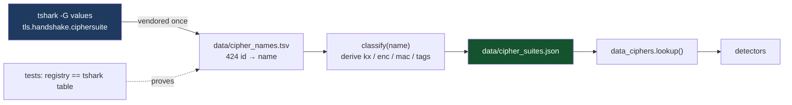

# Cipher policy

How this project decides that a cipher suite is weak, and why. The implementation is
`scripts/gen_cipher_suites.py`; the output is `src/pcapforensics/data/cipher_suites.json`; the
tests are `tests/test_cipher_registry.py`.

## 1. Names and ids come from tshark, never from a human



The first version of this project hand-typed the ~40 common suites. Cross-checking against
tshark showed **22 of the ids were wrong** — `0x0008` carried the name of the suite that actually
lives at `0x0009`, and several ChaCha20 and CCM entries were off by a small amount. Every one of
those is a finding that would have named the wrong suite on the wire.

So: names and ids are extracted from tshark's own value table and vendored into
`data/cipher_names.tsv` (424 entries). `tests/test_cipher_registry.py` asserts that the registry
agrees with that table for every id, so a future regeneration cannot silently drift.

## 2. Everything else is derived from the name

The IANA name encodes the whole structure:

```
TLS_<KX>_WITH_<ENC>_<MAC>      TLS_ECDHE_RSA_WITH_AES_128_GCM_SHA256
TLS_<ENC>_<MAC>                TLS_RSA_WITH_AES_128_CBC_SHA     (implicit RSA)
TLS_AES_128_GCM_SHA256         TLS 1.3: no KX, no MAC field
```

`split_name()` turns that into `(kx, enc, mac)`; `classify()` applies the tag rules. Deriving beats
maintaining a hand-written table of 424 properties, and it is testable in both directions.

## 3. Forward secrecy

`forward_secrecy = True` when the key exchange is ephemeral:

```
DHE, ECDHE, DHE_PSK, ECDHE_PSK, PSK_DHE, PKE_DHE      and every TLS 1.3 suite
```

Otherwise `False`, with the exception that a *bare* `PSK` is `False`: a static pre-shared key gives
no perfect forward secrecy, because the key itself is the long-term secret.

`forward_secrecy_for(session)` is the session-level function and returns a tri-state:

| Value | When |
|---|---|
| `True` | TLS 1.3, or an ephemeral suite was negotiated |
| `False` | a static suite was negotiated, with the reason string naming the key exchange |
| `None` | the chosen suite is unknown, the ServerHello is missing, or the cipher is not in the registry — with the reason recorded |

`None` exists so a detector cannot accidentally report "no forward secrecy" for a handshake the
capture never showed.

## 4. Tags

| Tag | Meaning |
|---|---|
| `NULL_ENCRYPTION` | no confidentiality at all |
| `EXPORT_GRADE` | 40/56-bit keys |
| `RC4`, `RC2`, `DES`, `3DES`, `IDEA`, `SEED` | broken or withdrawn ciphers |
| `MD5_MAC`, `SHA1_MAC`, `CRC32_MAC` | broken or deprecated integrity |
| `ANONYMOUS` | unauthenticated key exchange |
| `GOST` | Russian standard, approved in some jurisdictions only |
| `NO_FORWARD_SECRECY` / `STATIC_RSA` | the key exchange is not ephemeral |
| `CBC_MODE` | Lucky13 / Sweet32 exposure class |
| `AEAD` | modern authenticated encryption |
| `PFS` | the suite provides forward secrecy |
| `IOT` | constrained/IoT profile (CCM): often legitimate, verify device requirements |
| `SIGNALING` | SCSV and other non-cipher values |
| `TLS13` | TLS 1.3 suite |

## 5. Tiers

`deprecation` is **this project's policy**, not a verbatim RFC column:

| Tier | Rule | Severity it drives |
|---|---|---|
| `prohibited` | any of NULL_ENCRYPTION, EXPORT_GRADE, RC4, RC2, DES, 3DES, IDEA, SEED, MD5_MAC, MD2_MAC, ANONYMOUS, CRC32_MAC, GOST | critical / high |
| `deprecated` | no forward secrecy (static RSA, bare PSK) | high |
| `legacy` | CBC mode or SHA-1 MAC, without the above | medium |
| `acceptable` | AEAD with forward secrecy, TLS 1.2 | info |
| `recommended` | TLS 1.3 suite | info |
| `signalling` | not a cipher | never a finding |

## 6. Elliptic-curve size

<!-- curve-policy: deprecated_below=224 minimum=256 -->

The suite tiers above are about *cipher suites*. A curve size is a separate question, and until #151
it was answered in exactly one place -- as two integer literals inside
`detectors/tls_cipher.py::weak_key_verdict` -- with no document behind it and no way for a second
consumer to read the same number. Both now live in `data_ciphers`.

| Curve size | Verdict | Why |
|---|---|---|
| below 224 | `high` | far below anything still in use, and treated as broken |
| 224 to 255 | `medium` | deprecated for TLS by RFC 8422, but not a break |
| 256 and up | not reported | secp256r1 and up |

**The citation is TLS-specific on purpose.** RFC 8422 section 5.1.1 says:

> RFC 4492 defined 25 different curves in the NamedCurve registry [...] for use in TLS. Only three
> have seen much use. This specification is deprecating the rest (with numbers 1-22).

and the enumeration it leaves in place is `secp256r1 (23)`, `secp384r1 (24)`, `secp521r1 (25)`,
`x25519 (29)` and `x448 (30)`. That range of 1-22 contains `secp192r1`, `secp224r1`, `secp192k1`
and `secp224k1`, so for TLS a curve under 256 bits is deprecated. A general key-management document
would also give a curve-size floor, but it would not be about TLS, and this tool reports on TLS.

**Why 224 and 256 are two numbers and not one.** RFC 8422 puts `secp224r1` in the same deprecated
bucket as `secp192r1`. The split is this project's judgement about severity, not the RFC's: a
112-bit curve is not a practical break, so it does not rank beside a 512-bit RSA key. The rule doc
says so in as many words, and the code's job is to keep them apart.

**What is deliberately not here.** A DSA threshold. A DSA prime size is not comparable with an RSA
modulus, and no source consulted gives a curve-style floor for it in TLS terms, so
`weak_key_verdict` reports DSA as undecided rather than guessing. Adding a number would be the exact
error that branch exists to prevent (#155).

## 7. Provenance

* **RFC 9325** section 4.1 — suites that MUST NOT be negotiated (NULL, RC4, under 112-bit/export) or SHOULD NOT be (under 128-bit, static RSA, non-ephemeral DH).
* **NIST SP 800-52r2** — allowed cipher suites for TLS: static-RSA and 3DES restrictions.
* **RFC 7457** (Sweet32, 3DES/CBC birthday exposure), **RFC 7465** (RC4 prohibition),
  **RFC 6194** (SHA-1), **RFC 5246** (TLS 1.2 suite list).
* The tier boundaries are ours. Where a suite is legal in a specific context (CCM on an IoT device,
  PSK in a mesh network) the report says so in `summary` rather than pretending the rule is absolute.

## 8. Working with the registry

```bash
make regenerate                                    # rebuild from the vendored names
python scripts/gen_cipher_suites.py --refresh      # re-extract names from the local tshark first
pcap-doctor suites                                          # dump the registry with its tiers
pcap-doctor ciphers capture.pcap                            # see it applied to a capture
```

Never hand-edit `cipher_suites.json`; it is generated, and a test compares it to the names table.
To change a tier, change `deprecation_for()` in the generator and say in the commit why.
