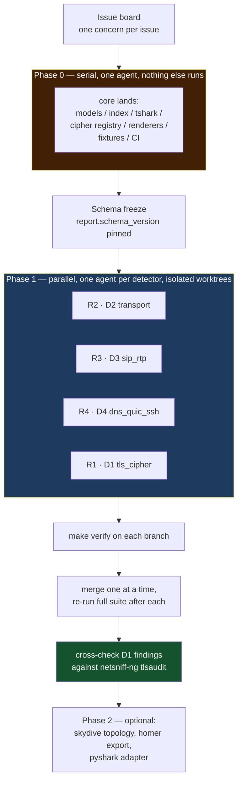
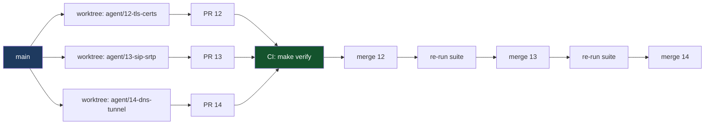

# Subagent playbook

This is how to run a fleet of agents on this repository without them colliding. The rules it
enforces are the ones in `AGENTS.md`; this document is the operational half.

## The shape of the workflow



**Phase 0 is not parallelisable.** Four agents with no index contract invent four incompatible
flow models, and the merge becomes archaeology. Land the core first, freeze the schema, then fan
out. Skipping this is the most common way this kind of project dies.

## Agent roles

| Role | Scope | May edit |
|---|---|---|
| **R0 core** | the schema, the index, the tshark boundary, the cipher registry, renderers, CI, this playbook | everything except other agents' detectors |
| **R1 crypto** | `detectors/tls_cipher.py` | its own file, its fixture, its tests, its README row |
| **R2 transport** | `detectors/transport_exposure.py` | same |
| **R3 voice** | `detectors/sip_rtp.py` | same |
| **R4 protocol** | `detectors/dns_quic_ssh.py` | same |
| **R5 qa** | review + oracle harness | tests only |

## Isolation mechanics



```bash
# one worktree per agent, from the same frozen commit
git worktree add ../pf-12 -b agent/12-tls-certs
git worktree add ../pf-13 -b agent/13-sip-srtp
git worktree add ../pf-14 -b agent/14-dns-tunnel
```

Rules that make this safe:

* **Same base commit.** Fan out from the freeze commit, not from `main` HEAD, or agents will
  disagree about which schema they were written against.
* **No shared cache directory by accident.** Point each agent at its own `PCAP_FORENSICS_CACHE` if
  they run concurrently on one machine; the cache is content-addressed but concurrent writes are
  not worth reasoning about.
* **One PR per issue.** If an agent produces two PRs, it did two issues.
* **Rebase is a merge event.** Agents never rebase onto each other; core rebase is done by R0 after
  the rest has landed.

## The prompt to hand an agent

Copy this. It is the whole brief; anything not in it is out of scope.

```text
You are agent R<role> for pcap-forensics, working on issue #<N>: <title>.

Working directory: <worktree path>. Base commit: <sha>.

Read, in order: AGENTS.md, docs/detector-authoring.md, and the README section for your detector.

Your allowlist (edit nothing else):
  src/pcapforensics/detectors/<yourfile>.py
  tests/fixtures/<yourfixture>.pcap and its generator block in scripts/make_fixtures.py
  tests/test_detectors.py   (only the tests you add)
  README.md                 (only the one detector-table row for your detector)

Do not edit models.py, index.py, tshark.py, data_ciphers.py, certificates.py, or render/*.
If you need a field that is not in the index, stop, comment on the issue with a proposed field
(shape + example value + which detectors need it), and do not work around it by re-parsing tshark.

Definition of done: the checklist in AGENTS.md section 3.
Before you push: `make verify` must be green and `pcap-doctor doctor` must pass.
```

## Definition of done, mechanically

`make verify` is the gate: `ruff check .`, `mypy` (strict), `pytest`. Add to that:

* the new detector is listed by `pcap-doctor detectors` and reports a version,
* `pcap-doctor analyze` on its fixture produces the expected codes,
* the README detector table has its row,
* no file outside the allowlist is in the diff (`git diff --name-only base..HEAD`).

## Oracle: cross-check D1 against an independent tool

An analyzer that only agrees with itself is a machine, not a tool. `netsniff-ng` ships `tlsaudit`,
which reports the same class of findings from the same capture with an independent implementation.
Use it on the TLS fixtures:

```bash
netsniff-ng -r tests/fixtures/weak_tls.pcap -c /dev/null   # or: tlsaudit
```

Any suite we call weak and tlsaudit does not, or the reverse, is an issue — not a footnote. Wire
this as a non-blocking job first; make it blocking once the two agree on the corpus.

Other oracles, each with a different bias:

| Tool | Independent bias | Use it for |
|---|---|---|
| `netsniff-ng tlsaudit` | crypto, C-focused | D1 suite/weakness verdicts |
| `skydive` | topology and flow model | validating our flow graph semantics |
| `homer` | SIP/RTP call correlation and quality | D3 media verdicts |
| Wireshark's own corpus | ground truth for the dissectors we depend on | `tests/test_corpus.py` |

## Budget and stopping rules

* One agent, one issue, at most three PRs. A fourth means the issue was wrong.
* If an agent has not produced a passing `make verify` in two attempts, stop and re-scope. The
  second failure is usually a schema gap it should have filed.
* If two agents both need the same core field, R0 adds it once, in a core PR, and both rebase.

## Anti-patterns seen in projects like this

* **Fanning out before the core lands.** Four schemas, one merge conflict per file.
* **Letting agents edit `models.py`.** The schema accretes per-agent field names and nobody can
  tell what is load-bearing.
* **Asserting on prose in tests.** Every rewording turns CI red, so agents stop rewording and start
  gaming the wording.
* **No negative fixtures.** A detector that fires on everything is "done" and useless.
* **Trusting a report nobody read.** Have the QA agent read `03-findings.md` for a corpus capture
  end to end and file issues for anything they would not act on at 2am.
